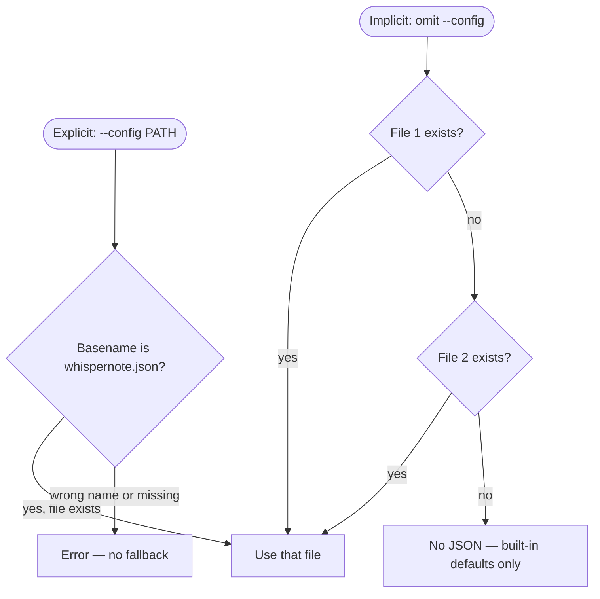

# WhisperNote

Local diarized transcription on **Apple Silicon** combining [MLX Whisper](https://github.com/ml-explore/mlx-examples/tree/main/whisper) for **ASR** (**automatic speech recognition**: turning spoken audio into text) and [pyannote.audio](https://github.com/pyannote/pyannote-audio) for speaker diarization (who spoke when).

Word-level timestamps are merged with diarization using a midpoint rule, then exported as `srt`, `txt`, `json`, or `md`.

## Documentation for agents and contributors

- **[`AGENTS.md`](AGENTS.md)** — agent contract and agnostic skills policy for this repo.
- **[`.skills/_index.md`](.skills/_index.md)** — skill manifest (authoring helpers plus WhisperNote-specific skills: Hugging Face setup, pipeline internals, export formats, testing, models).

End-user setup and options remain in this README; skills hold **concise, agent-oriented** checklists that track [`pyproject.toml`](pyproject.toml), [`scripts/`](scripts/), and [`src/whispernote/`](src/whispernote/).

## Prerequisites

- **[`uv`](https://docs.astral.sh/uv/)** — WhisperNote uses `uv` for dependency management and virtual-environment creation. Install it with `curl -LsSf https://astral.sh/uv/install.sh | sh` or `brew install uv`.

- **Python 3.10 or newer** — `uv` will install a compatible interpreter automatically if needed (the repo pins **3.12** via [`.python-version`](.python-version)). That matches **`requires-python`** in [`pyproject.toml`](pyproject.toml) (`>=3.10`).

- **`ffmpeg`** — WhisperNote shells out to `ffmpeg` to normalize input to 16 kHz mono PCM before ASR and diarization. Install it however you like; it must be on your `PATH`.

  ```bash
  brew install ffmpeg
  ```

## Quick start

#### 1. **Install the project**

   `uv sync` creates a virtual environment (`.venv`), installs a matching Python if needed, and resolves all dependencies from the committed [`uv.lock`](uv.lock) for reproducible builds. The `--extra dev` flag pulls in the optional `dev` extras (e.g. `pytest`).

   ```bash
   uv sync --extra dev
   ```

#### 2. **Hugging Face access**

   For **gated** models (the default [pyannote diarization pipeline](https://huggingface.co/pyannote/speaker-diarization-community-1) and any Hub-hosted MLX Whisper checkpoints you use), Hugging Face requires two things — **in this order on the website**:

   1. **Accept the user conditions** on each model card you need (otherwise downloads fail even with a token). The [community-1 diarization README](https://github.com/pyannote/pyannote-audio?tab=readme-ov-file#community-1-open-source-speaker-diarization) describes this flow.
   2. **Create an access token** at [hf.co/settings/tokens](https://huggingface.co/settings/tokens).

   **Locally**, store that token so WhisperNote can authenticate (convenient for day-to-day runs; it does not replace step 1):

   ```bash
   cp .env.example .env
   # edit .env: HF_TOKEN=hf_...
   ```

   `python-dotenv` loads `.env` from the **current working directory** when you run `whispernote`. You can instead `export HF_TOKEN=...` in your shell.

#### 3. **Run**

   Example: transcribe a local recording and write SubRip subtitles to the **current working directory**.

   ```bash
   uv run whispernote ~/Documents/meeting.m4a --format srt
   ```

   That normalizes the audio, runs diarization and MLX Whisper, merges speakers, and writes **`meeting.srt`** in the **current working directory** (same base name as the input file, extension from `--format`). If you omit `--format`, the default is **`srt`**.

For optional flags, output paths, and model overrides, see **[Usage and options](#usage-and-options)** below.

## Usage and options

```text
whispernote [OPTIONS] INPUT_FILE
```

**`INPUT_FILE`** (required) — Path to a local audio or video file **`ffmpeg` can decode**. Pass a file on disk, not a URL.

### General options

| Option | Description |
| --- | --- |
| `-h`, `--help` | Show help and exit. |
| `--format FORMAT` | Export format: `srt` (default), `txt`, `json`, or `md`. Controls the file extension and layout of the transcript. |
| `--output PATH` | **Optional.** Where to write the transcript. If omitted, the file is **`./<basename>.<format>`** — i.e. the input file’s base name plus the extension for `--format`, in the **current working directory** (not necessarily next to the input file). If `PATH` is an existing directory (or ends with a path separator), WhisperNote writes **`<basename>.<format>`** inside that directory. Otherwise `PATH` is treated as the full output file path (directories are created as needed). |
| `--config PATH` | Optional `whispernote.json` path (basename must match exactly). |
| `--model-asr` / `-ma` `ID_OR_PATH` | Override MLX Whisper checkpoint (`path_or_hf_repo`). |
| `--model-diarization` / `-md` `ID_OR_PATH` | Override pyannote diarization pipeline (advanced; see [Model and config overrides](#model-and-config-overrides)). |

**Config and models** — Resolution order and JSON keys are documented under **[Model and config overrides](#model-and-config-overrides)** inside [Model behavior](#model-behavior-local-first).

## Supported input and output

| | |
| --- | --- |
| **Input** | Any audio or video format **`ffmpeg` can decode** (e.g. `mp3`, `wav`, `m4a`, `mp4`). |
| **Output** | With `--format`: `srt` → `.srt`, `txt` → `.txt`, `json` → `.json`, `md` → `.md`. Default output path is **`./<basename>.<format>`** unless `--output` is set (see above). |

## Model behavior (local-first)

Inference runs on your machine.

### Defaults

| Component | Default | Notes |
| --- | --- | --- |
| ASR | `mlx-community/whisper-tiny` | Same default as [`mlx-whisper` on PyPI](https://pypi.org/project/mlx-whisper/) (`path_or_hf_repo`). |
| Diarization | `pyannote/speaker-diarization-community-1` | Open-source pipeline from pyannote on Hugging Face ([model card](https://huggingface.co/pyannote/speaker-diarization-community-1)); **gated**—log in, accept terms, set `HF_TOKEN` (see [Quick start](#quick-start)). |

### Hugging Face Hub cache

On first use, Hub weights are downloaded into:

```text
~/.cache/huggingface/hub
```

That matches how [`mlx_whisper.transcribe`](https://pypi.org/project/mlx-whisper/) resolves `path_or_hf_repo`: a Hub id triggers a one-time download, then reuse from cache.

### Model and config overrides

Hub authentication uses the **`HF_TOKEN`** environment variable (or `.env`); it is **not** stored in `whispernote.json`, and there is **no** per-field token for `diarization_model` or `asr_model`—one token covers all Hugging Face downloads (pyannote pipelines, MLX Whisper Hub checkpoints, etc.). See [Quick start](#quick-start).

**Precedence:** CLI flags (`-ma`, `-md`, `--config`) → values in `whispernote.json` → [Defaults](#defaults) above.

**Which `whispernote.json` wins** depends on whether you pass `--config`:



File 1: `./whispernote.json` (current working directory). File 2: `~/.config/whispernote/whispernote.json`.

| Option | Description |
| --- | --- |
| `--config PATH` | Path to a config file whose **basename must be exactly `whispernote.json`**. Any other basename exits with an error that repeats these rules. If `--config` is omitted, discovery follows the diagram above. |
| `--model-asr` / `-ma` `ID_OR_PATH` | MLX Whisper `path_or_hf_repo` (Hub id or local directory). Overrides `asr_model` in JSON. |
| `--model-diarization` / `-md` `ID_OR_PATH` | Overrides `diarization_model` in JSON. **Documented for advanced use**; WhisperNote targets the default community-1 pipeline. |

The `--config` basename check is **case-sensitive** on typical Unix filesystems (e.g. `WhisperNote.json` is not accepted).

**JSON keys** (object in `whispernote.json`): `asr_model`, `diarization_model` (Hub ids or local paths only—never a token). See [`whispernote.json.example`](whispernote.json.example).

**Example** (larger ASR model):

```bash
whispernote ./audio.m4a -ma mlx-community/whisper-large-v3-mlx
```

### Offline / local pyannote pipeline

After you have accepted the model terms and cloned the pipeline (see [offline use](https://huggingface.co/pyannote/speaker-diarization-community-1)), you can point `--model-diarization` / `-md` (or `diarization_model` in JSON) at that directory. In that case **no `HF_TOKEN` is required** for loading the pipeline from disk.

### What we do not support

- **pyannote “precision-2” / pyannoteAI cloud** and other paid or remote-only flows are out of scope for this repo.

### Choosing other MLX Whisper checkpoints

Browse the Hugging Face **[mlx-community Whisper collection](https://huggingface.co/collections/mlx-community/whisper)** and pass any compatible repo id via `--model-asr` / `-ma` or `asr_model` in config.

## Tests

From the repository root (after `uv sync --extra dev`):

```bash
uv run pytest
```

[`pyproject.toml`](pyproject.toml) sets **`pythonpath = ["src"]`** for pytest so the `whispernote` package resolves from the **`src/`** layout without setting `PYTHONPATH` by hand. You still need the runtime stack available where tests import it (e.g. anything that loads `diarize` pulls in PyTorch / pyannote).

## License

MIT

## Upstream libraries, licensing, and telemetry

### MLX Whisper

WhisperNote calls **[mlx-whisper](https://pypi.org/project/mlx-whisper/)** for speech recognition. That package is published on PyPI under the **MIT** license (see the project page for the current license text).

### pyannote.audio

WhisperNote uses **[pyannote.audio](https://github.com/pyannote/pyannote-audio)** for speaker diarization (default pipeline: [`pyannote/speaker-diarization-community-1`](https://huggingface.co/pyannote/speaker-diarization-community-1)). If you publish work that builds on pyannote.audio, cite it using the [official bibliography](https://github.com/pyannote/pyannote-audio?tab=readme-ov-file#citations):

```bibtex
@inproceedings{Plaquet23,
  author={Alexis Plaquet and Hervé Bredin},
  title={{Powerset multi-class cross entropy loss for neural speaker diarization}},
  year=2023,
  booktitle={Proc. INTERSPEECH 2023},
}

@inproceedings{Bredin23,
  author={Hervé Bredin},
  title={{pyannote.audio 2.1 speaker diarization pipeline: principle, benchmark, and recipe}},
  year=2023,
  booktitle={Proc. INTERSPEECH 2023},
}
```

### pyannote.audio optional telemetry

pyannote.audio can send **anonymous** usage metrics to help the pyannote team; see their [telemetry section](https://github.com/pyannote/pyannote-audio?tab=readme-ov-file#telemetry).

**WhisperNote sets `PYANNOTE_METRICS_ENABLED` to `0` when that variable is not already set** (before importing pyannote), so this telemetry is **off by default** for runs started through this CLI. To **opt in**, set in `.env` or your environment **before** starting Python, for example:

```bash
export PYANNOTE_METRICS_ENABLED=1
```

(or add the same line to `.env`; see [`.env.example`](.env.example).)

When telemetry is **enabled**, pyannote documents that processing may report (among other things):

- **Audio duration** in seconds for each file passed to a pipeline
- For speaker diarization pipelines: **`num_speakers`**, **`min_speakers`**, and **`max_speakers`** when those parameters are used
- For `Pipeline.from_pretrained(...)` / `Model.from_pretrained(...)`: **coarse origin** of the model (e.g. official Hub id vs `local` vs other Hub)

They state they do **not** collect information that identifies you personally. WhisperNote does **not** implement separate telemetry or relay this data beyond what pyannote.audio does when you opt in.
